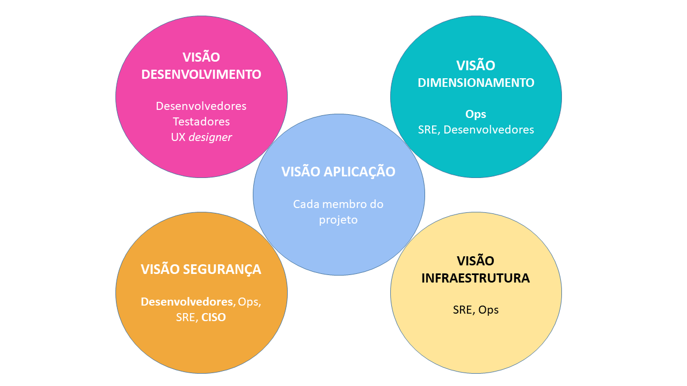

# Projeto modelo-documentacao-arquitetura

Este modelo de arquitetura é aplicável à maioria dos projetos de gerenciamento de TI, sem considerar a arquitetura geral escolhida (monolítica, SOA, microsserviços, n-tier, ...).
Já tem sido utilizado em vários grandes projetos privados ou organizações governamentais. Ele é mantido em uma base regular.

Outras línguas : https://github.com/bflorat/modele-da[Francês], https://github.com/bflorat/architecture-document-template[Inglês]

*Se você utiliza e gosta deste modelo, você pode nos agradecer *starring* o projeto e/ou nos permitindo listar sua organização nas referências (endereço https://florat.net/contact[aqui])*

## Princípios do modelo
Nós temos dividido a arquitetura em 5 visões (aplicação, segurança, dimensionamento, infraestrutura e desenvolvimento), cada visão sendo principalmente autossustentável.

A ideia é oferecer um conjunto de *visões de arquitetura alinhada com papéis que são mais frequentemente encontrados nas organizações e suas respectivas preocupações*.
Por exemplo, um arquiteto de infraestrutura ou um engenheiro DevOps raramente precisa conhecer detalhes da arquitetura de software
(os detalhes dos frameworks utilizados ou como lidar com erros). Bem como, um PO ou um arquiteto de negócio estará interessado em uma visão macroscópica dos módulos da aplicação e suas principais interações ("processo batch B requisita serviço S") mas raramente por detalhes da infraestrutura subjacente (escolha de serviço de base de dados, tamanho da máquina, etc.).

Uma documentação de projeto seguindo este modelo será assim constituída por : 

* an link:view-application.adoc[visão aplicação] apresentando o contexto geral e a arquitetura da aplicação;
* a link:view-development.adoc[visão desenvolvimento] apresentando a arquitetura de software e o ambiente na qual será disponibilizado;
* a link:view-sizing.adoc[visão dimensionamento] apresentando aspectos relacionados com a performance e dimensionamento da infraestrutura;
* an link:view-infrastructure.adoc[visão infraestrutura] apresentando os servidores, middleware, operações, etc.;
* a link:view-security.adoc[visão segurança].

Cada seção é dividida de acordo com o seguinte padrão  :

* *Restrições* (jurídica, orçamentária, tecnológica, normativo, ...) aplicável ao projeto;
* *Requisitos Não-funcional* (RNF) expressado pelos líderes do projeto dentro dos limites de restrições;
* *Solução* (descrição da arquitetura escolhida respondendo ao RNF).

O arquivo também inclui um exemplo de glossário que pode ser utilizado como um apoio para a https://martinfowler.com/bliki/UbiquitousLanguage.html[Línguagem Ubíqua], um elemento fundamental da sua arquitetura.

Para mais detalhes, confira https://www.emerald.com/insight/content/doi/10.1108/ACI-12-2020-0159/full/html?utm_source=rss&utm_medium=feed&utm_campaign=rss_journalLatest[este artigo] publicado na Applied Computing and Informatics.

## Utilizando este modelo
### Apresentação Geral
* Este modelo foi escrito utilizando https://www.methods.co.nz/asciidoc/index.html[asciidoc]. Você pode converter ele para o formato da sua escolha mesmo se nós recomendamos um *formato textual e legível* (tipo Markdown) fácil para seguir e modificar por requisições de merge em uma ferramenta de versionamento. Isso ajuda a tornar seu documento uma documentação viva;
* Este modelo pode ser aperfeiçoado, é por isso que todos os comentários, criticismo (construtivo), contribuições e sugestões são apreciadas (por favor faça um https://github.com/bflorat/architecture-document-template/pulls[pull request]
ou crie uma https://github.com/bflorat/architecture-document-template/issues[issue/questão]);
* Além disso, é voluntariamente *rico em explanações e exemplos* porque também é uma (modesta) forma de aprendizagem destinada aos estudantes e jovens arquitetos.
* Texto em itálico contém exemplos;
* Cada capítulo contém notas e dicas para ajudar a preenchê-lo;
* link:blank-template[Modelos vazios] (sem exemplos) são providos para sua conveniência. *É fortemente recomendado iniciar com um modelo em branco tendo um modelo com exemplos e explicações na sua frente em outra janela*;
* O script 'export' provido junto com o modelo em branco pode ser utilizado para exportar seu documento Asciidoc para um PDF, HTML ou pacote ODT para que possa ser exportado facilmente de um repositório Github ou Gitlab, por exemplo.

### Conselho sobre ao escrever seu documento de arquitetura
* *Seja breve*, cada palavra deve fazer sentido. Nenhuma explicação inútil típica de 'esta é a introdução', sem repetição de outro documento, história da companhia ou conceitos vagos;
* O leitor deve entender a operação e restrições da aplicação sem ser inundado com detalhes. O *documento deve se manter sustentável e atualizado*;
* Se a aplicação seguir os padrões de arquitetura da sua organização, nunca repita isso *(https://en.wikipedia.org/wiki/Don%27t_repeat_yourself[DRY] princípio*) e referencie para um documento comum;
* Se o capítulo não é aplicável, não deixe isto em branco, mas simplesmente mencione `N/A` (Não Aplicável) para que o leitor saiba que o assunto tem sido coberto e `TODO` (Para fazer) ou `WIP` (Trabalho em andamento) se isso resta ser completado;
* Este modelo tem como objetivo ser *abrangente o suficiente para cobrir a maioria do gerenciamento dos aplicativos de sistemas de informações*. Portanto, pode ser normal que alguns capítulos não são aplicáveis no seu contexto;
* Liste as *suposições arquiteturais* e estudos em progresso no capítulo "Pontos não resolvidos" de cada seção (eles devem ser excepcionais, caso contrário, o documento é escrito muito cedo);
* *Isolar nos apêndices* no final do documento as informações arquiteturais importantes, mas somente sobre pontos de interesse específicos para alguns leitores.

### O que este documento * NÃO * é?
** o *desenho detalhado* do projeto (diagramas UML de classes, sequências...) exceto para apresentar um padrão geral específico para a aplicação;
** *elementos de estudo* (SWOT, cenários, etc.): as escolhas já devem ter sido feitas (no entanto, incentivamos o fornecimento de https://adr.github.io/[ADRs] junto com o documento de arquitetura);
** a *urbanização* de todo um Sistema de Informação (SI). Estamos nos posicionando aqui ao nível de uma única aplicação ou de um conjunto de módulos coerentes;
** as *regras da arquitetura de referência* (comuns a todos os módulos de aplicação do SI);
** detalhes técnicos (IP, logins) que possam comprometer a segurança;
** *arquitetura física* (detalhes de servidores e datacenters, arquitetura de rede, arquitetura de armazenamento, provisionamento, etc.). Esses são assuntos muito específicos e geralmente são tratados por arquitetos de infraestrutura em nível de SI;
** detalhes de *ambientes* além da produção (aceitação, desenvolvimento, etc.). Eles geralmente são muito flutuantes para aparecer neste arquivo e se beneficiarão de serem documentados pelo integrador em vez de outros arquivos, wikis ou ferramentas CMDB.

## Perguntas frequentes
* **A partir de que tamanho de projeto este modelo é elegível?** Este modelo foi usado com sucesso em um projeto individual. Ele pode ser usado para qualquer tamanho de projeto. Um grande projeto provavelmente preencherá mais seções, mas a maioria se relaciona a todos os projetos. Por exemplo, questões de disponibilidade ou internacionalização não estão relacionadas ao tamanho de um projeto em nossa opinião.
* **Este modelo pode ser usado como base para um repositório de arquitetura?** Mesmo que muitas ideias possam ser adotadas, não, esse não é o objetivo deste modelo.
* **Este modelo é adequado para um programa completo?** Para um programa completo, recomendamos uma abordagem do tipo TOGAF com as entregas associadas. Por outro lado, as fases C e D podem ser documentadas por um DA dentro de cada projeto deste programa.
* **Como documentar as trajetórias da arquitetura?** Recomendamos descrever a trajetória geral (sem entrar em muitos detalhes) na seção "Arquitetura Geral" do componente da aplicação e descrever a arquitetura dos módulos futuros nas seções usuais dos diferentes painéis, mas especificando claramente qual é a etapa (por exemplo, prefixe o título de um módulo ou um fluxo que aparece apenas na etapa 2 com `[Etapa 2]`) . No entanto, tenha cuidado para evitar refatoração documental demais quando esta parte do projeto for implementada (links quebrados, por exemplo).
	** Trate os elementos descritos nas mesmas seções como os elementos a serem implementados imediatamente para tratá-los de acordo com a mesma lógica dos demais.
	** Quanto mais distante no tempo o elemento descrito estiver, menos sua arquitetura deve ser detalhada (é um bom princípio ágil da arquitetura 'Just In Time' que evitará reescrever essas seções muitas vezes).
	** Quanto mais próximo o elemento descrito estiver da arquitetura física, menos ele deve ser detalhado. Por exemplo, pode ser relevante documentar na seção de aplicação a arquitetura geral dos módulos que devem ser implementados em um ano, mas espere o máximo possível para documentar seu dimensionamento preciso na seção de dimensionamento. Da mesma forma, você pode documentar fluxos de aplicativos remotos, mas espere antes de descrever fluxos técnicos específicos na seção de infraestrutura.

## Licença
* Direito autoral (c) 2017-2021 Bertrand Florat e contribuidores
* Este modelo é licenciado debaixo de https://creativecommons.org/licenses/by-sa/4.0/[CC-BY-SA 4.0] : Creative Commons Attribution - Share Alike V4.0
* Você pode criar seu *próprio modelo* contanto que ele retenha a licença CC BY-SA 4.0 e, assim, contenha esses três elementos:
** O nome do criador (Bertrand Florat);
** Um link para https://creativecommons.org/licenses/by-sa/4.0/;
** Um aviso e um link para https://github.com/bflorat/architecture-document-template.
* A arquitetura *documentos resultantes deste modelo não se aplicam para esta licença*. Mesmo assim é recomendado incluir um link para https://github.com/bflorat/architecture-document-template[esta página].

## Obrigado
* https://github.com/bflorat/architecture-document-template/graphs/contributors[Contribuidores]
* Revisão: Dr. Christophe Gaie
* Retornos/Parecer: Antoine Parra Del Pozo, Pascal Bousquet, Philippe Mayjonade, Nicolas Chahwekilian, Steven Morvan
* Todos os digramas deste modelo foram gerados através da excelente ferramenta http://plantuml.com/[PlantUML]. O https://c4model.com/[Diagrama C4] utiliza o https://github.com/RicardoNiepel/C4-PlantUML[customizado C4 Plantuml].
* Lise Florat pela ajuda com a tradução para o Inglês.
* Thiago Rafael Ferreira pela ajuda com a tradução para o Português/Brasil.

## Bibliografia parcial
* _Site Reliability Engineering_ - Google
* _Living documentation_ - Cyril Martraire
* _Clean Code_ - Robert Martin
* _Performance des architectures IT - 2e ed._ - Pascal Grojean
* _Design Patterns: Elements of Reusable Object-Oriented Software by Erich Gamma, Richard Helm, Ralph Johnson and John Vlissides_ (GOF)
* _Le projet d’Urbanisation du SI_ - Christophe Longépé 
* _Sécurité de la dématérialisation_ - Dimitri Mouton

